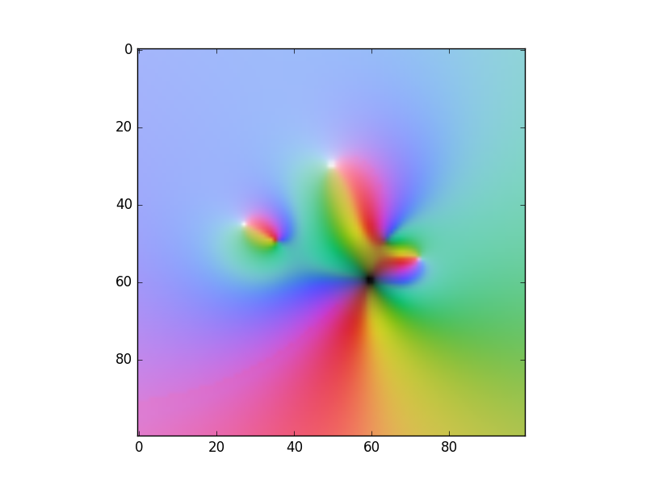

# colormap2d
This python package provides a carefully designed set of 2D colormaps that live in the perceptually uniform colorspace CAM02-UCS (Luo et al., 2006; Smith et al., 2016). Functionality to use the colormaps with matplotlib is included, as well as scripts that can be used from the 3D animation software Blender to design them.

2D colormaps are used to visualise images of two parameters at the same time, e.g.:
* a complex function's magnitude and argument as a function of its real and imaginary part
* a spatial map of windspeed and direction
* a time-frequency image of a signals strength and phase (spectrogram)
* a spatial map of seismic source energy and frequency.

## Features
* a growing set of carefully designed 2D colormaps
* matplotlib style python functions to plot data using the 2D colormaps
* 2D colormap designer based on the 3D animation software blender

## Installation
The module can be installed directly from github using:
```
pip install git+https://github.com/MMesch/cmap_builder.git
```

## Example
```
import numpy as np
import matplotlib.pyplot as plt
from colormap2d import imshow2d

# complex input data
x = np.linspace(-5, 5, 100)
regrid, imgrid = np.meshgrid(x, x)
zgrid = regrid + 1j * imgrid

complex_function = (zgrid ** 2 - 2.) * (zgrid - 1 - 1j) ** 2 /\
                   (zgrid + 2j) / (zgrid**2 - 5 - 2j)


# assemble [2, nwidth, nheight] array
data = np.array([np.angle(complex_function),
                 np.log(np.abs(complex_function))])

# plot to screen
imshow2d(data, cmap2d='wheel')
plt.show()
```


## Blender Colormap Designer
The associated blender script allows to generate colormaps in the uniform
colorspace CAM02-UCS (thank you colorspacious) by drawing a 3d spline path or a
3d spline surface in blender.

The most common 2D colormap used varies linearly in HSV/HSL colorspace. This
colormap is unfortunately not very smooth visually. The following image shows a
colormap that has been designed in blender. It starts at white and then goes
into the six corners of the CAM02-UCS Gamut.


Blender designed colormaps are much smoother than the classical HSV colormap.
The following comparison shows a complex polynomial that has poles. HSV
is shown in the top row as reference.


Click [here](doc/gallery.md) to see more colormaps in 3d colorspace.

Click [here](doc/install.md) to see how to install and use the script.
