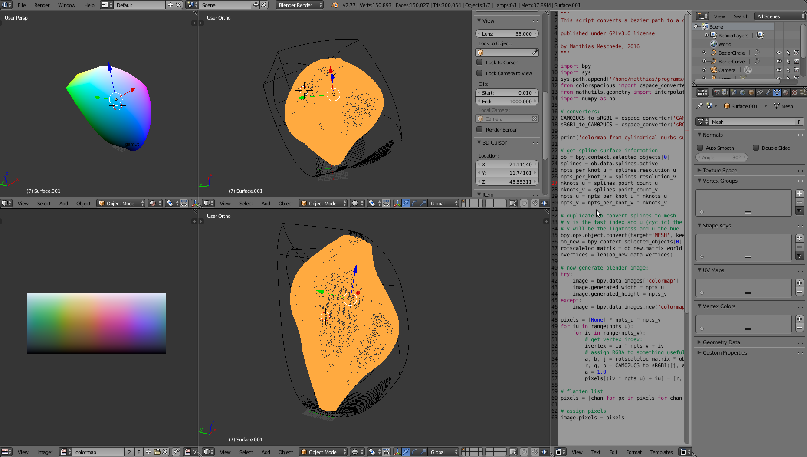
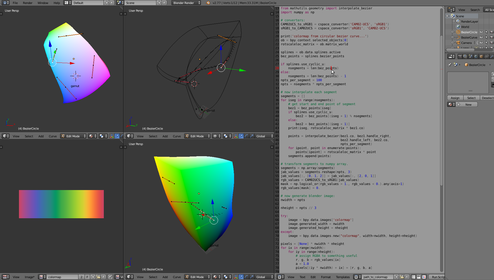
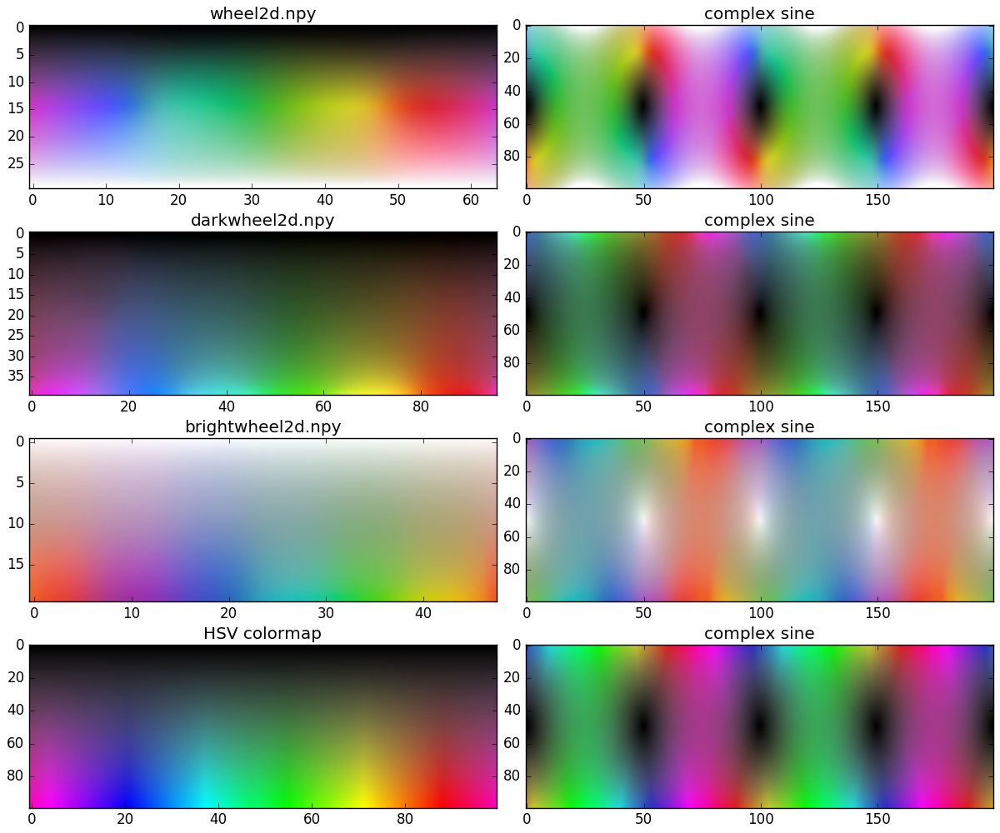

# blender colormap builder

## Overview
This is a blender script that allows to generate colormaps in the uniform
colorspace CAM02-UCS by drawing a 3d path in blender.

## Installation
1. clone the git repository somewhere on your system: `git clone ...`
2. install a python version that is compatible with blender and install the
   `colorspacious` module with `pip install colorspacious`. E.g. blender3.5.1.
   This is straightforward with anaconda python: first make a virtual
   environment with `conda create -n blender python=3.5`

## Instructions, 1d colormap
3. open the existing project `colormaps.blend` with blender.
4. in the python script `path_to_colormap`, change the path to point to your
   colorspacious module. E.g.: `sys.path.append('home/myname/anaconda2/envs/blender/lib/python3.5/site-packages'')`
5. you can now edit the control points of the bezier curves in the 3d window
   (make sure that your window is in `edit mode` to do this), or you can add
   a new curve in `object mode`. If you are done positioning your curve,
   make sure that it is selected and run the python script by pushing on `run script`
   or pressing `alt + p` when the script window is active. The colormap on
   the bottom left should now update.

## Instructions, 2d colormap

3. open the existing project `colormaps.blend` with blender.
4. in the python script `nurbs_to_colormap`, change the path to point to your
   colorspacious module. E.g.: `sys.path.append('home/myname/anaconda2/envs/blender/lib/python3.5/site-packages'')`
5. you can now edit the control points of the nurbs surface in the 3d window
   (make sure that your window is in `edit mode` to do this), or you can add
   a new curve in `object mode`. If you are done positioning your curve,
   make sure that it is selected and run the python script by pushing on `run script`
   or pressing `alt + p` when the script window is active. Be careful, the script
   generates a duplicate of the nurbs surface that you can delete after the
   colormap has been generated. The colormap on the bottom left should now update.

## Gallery:

## Included 2d colormaps:

