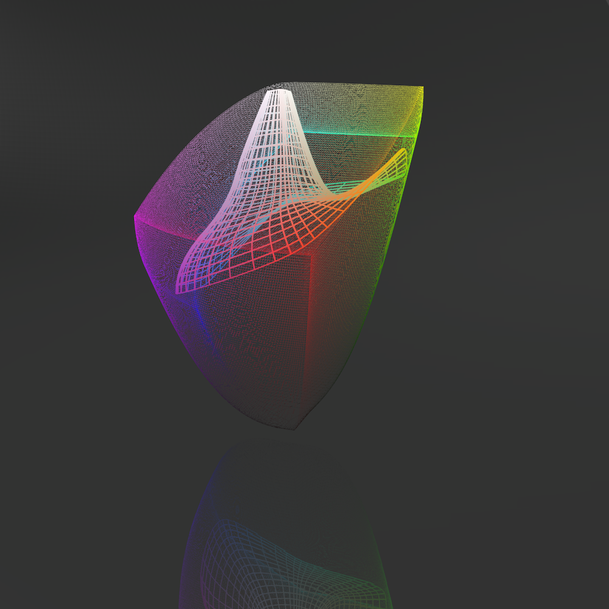
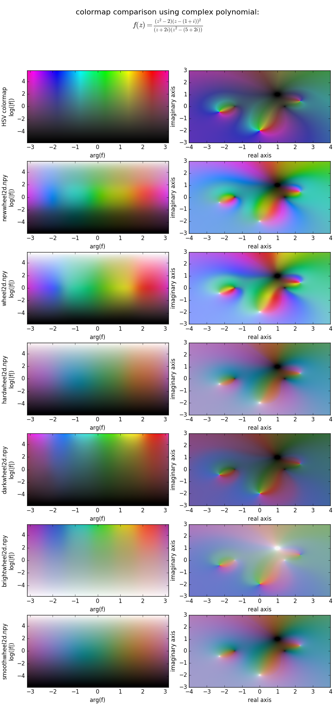

# blender colormap builder

## Overview
This is a blender script that allows to generate colormaps in the uniform
colorspace CAM02-UCS (thank you colorspacious) by drawing a 3d spline path
or a 3d spline surface in blender. Especially useful to design 2D colormaps.

2D colormaps can be used to visualise images of two parameters at the same
time. Typical examples are: a complex function's magnitude and argument,
 windspeed and direction, a signals strength and phase (spectrogram),
a signals energy and frequency.

The most common colormap used for this purpose are even variations in HSV/HSL
colorspace. Such a colormap is unfortunately not very smooth visually. The
following image shows a colormap that has been designed in blender. It
starts at white and then goes into the six corners of the CAM02-UCS Gamut.

Blender designed colormaps are much smoother than the classical HSV colormap
(bottom row) as the following comparison shows

Click [here](gallery.md) to see more colormaps in 3d colorspace.

Click [here](install.md) to see how to install and use the script.
