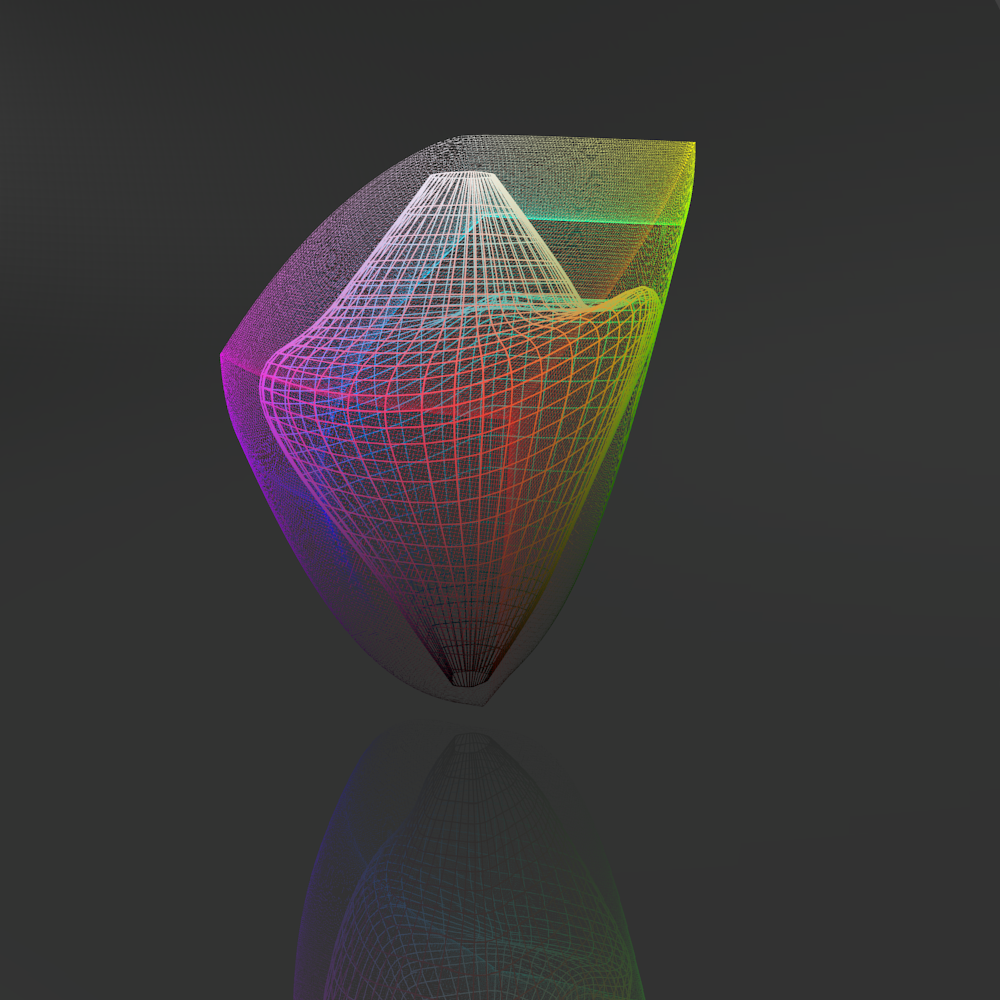

## Designing 2D Colormaps
Usual 1d colormaps can be represented as a path in a 3d colorspace. If the
colorspace is uniform, even movement along the path generates a smoothly
varying colormap.

This is an example of a 1d colormap that winds through 3d colorspace

For 2d colormaps, we need to put a surface instead of a path into colorspace.
Optimal colorsurfaces need to make a few compromises to use the maximum extend
of the colorspace while at the same time remaining as smooth as possible. 

Especially at convergent points around black (zero lightness) and white
(max lightness), the topology of the color surfaces has to be as even as
possible such that the lightness doesn't increase differently in different
directions. This ensures that maximum and minimums in displayed functions
remain round and don't become star-shaped or shifted towards darker colors
like blue and red. At 0.5, the color surfaces can vary a in lightness to make
use of strongy saturated colors.

Newwheel2d is a 2d colormap that goes from black to white with maximum saturated
colors around 0.5.

Wheel2d is similar to Newwheel but saturates the colors a bit more

Darkwheel2d is a 2d colormap that goes from black to light and saturated colors.
Exclusion of white allows for better coverage of the saturated corners of the
Gamut cube.

Brightwheel2d the equivalent of Darkwheel starting from white instead of black.
I have chosen slightly harder transitions between the six colors in this
colormap.

Smoothwheel2d is the equivalent of wheel2d with even lightness and even 
angular variations. The colors are smoother and less saturated but lightness
is much easier to identify because we don't need to adapt lightness to the
hue value 

## comparison with:

