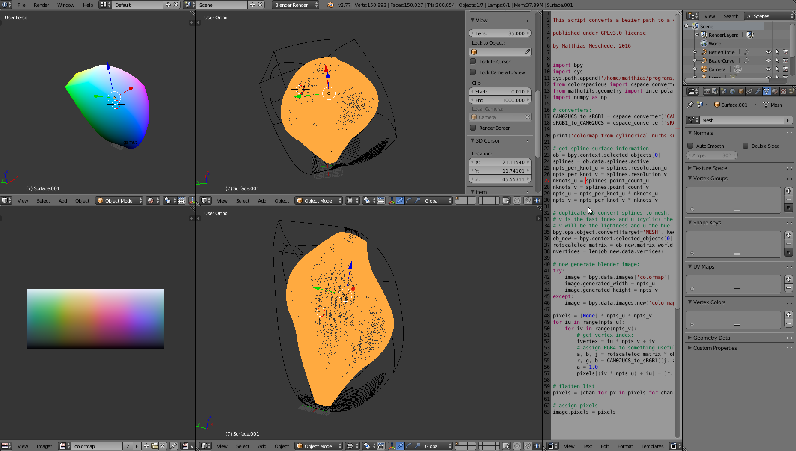
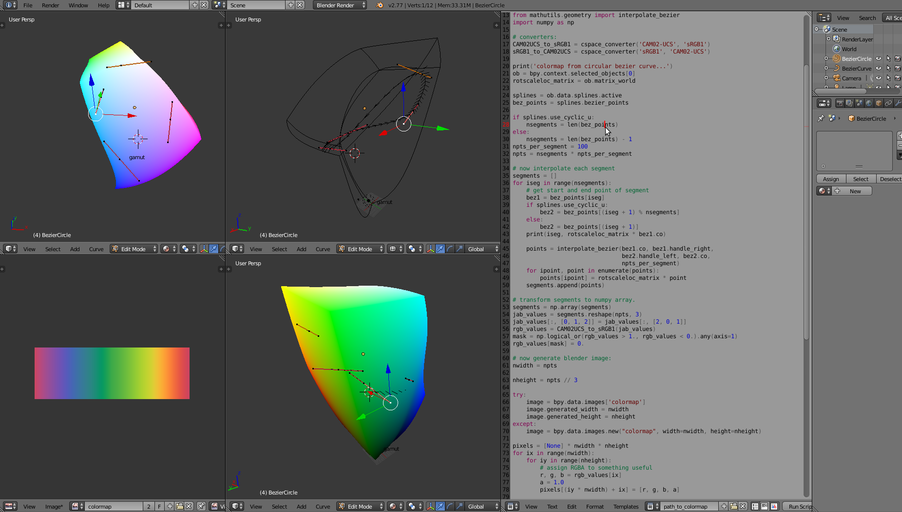

# Installation
1. clone the git repository somewhere on your system: `git clone ...`
2. install a python version that is compatible with blender (e.g. python 3.5.1 for
   blender 2.77a) and install the
   `colorspacious` module with `pip install colorspacious`.
   This is straightforward with anaconda python: first make a virtual
   environment with `conda create -n blender python=3.5`. 
   Then do `source activate blender` to activate the environment and install
   colorspacious with `pip install colorspacious`

## The `colormap.blend` project file
1. open the project `colormaps.blend` with blender.
2. click on the different layers (little boxes at the bottom right of the 3d
   view windows) and check out the objects that are within each by doing a right
   click on the objects. The layers are organized like this:
 * layer 1: contains a precomputed Gamut surface and can be used to position
   a surface or path in the Gamut to compute the colormap
 * layer 2: this is the render layer. Computed and colored meshes can be put
   here for advanced visualizations
 * layer 3: this is the dump layer for lots of different spline surfaces and
   paths that are ready to be taken to layer 1 for colormap computation
 * layer 4: this is the dump layer for modified, and colored non-spline 
   surfaces or paths.

## Instructions, Gamut surface sript
2. in the python script `Add_Gamut` (can be selected on in the footline
   of the text window on the right), change the path to point to your
   colorspacious module. 
   E.g.: `sys.path.append('home/myname/anaconda2/envs/blender/lib/python3.5/site-packages'')`
3. run the script with `alt + p` when the text window is active or click
   the `run script` button in the footline of the text editor window.
   A new Gamut surface is generated. You can modify the resolution of the Gamut
   cube in the script.

## Instructions, path to colormap script
2. in the python script `path_to_colormap` (can be selected on in the footline
   of the text window on the right), change the path to point to your
   colorspacious module. 
   E.g.: `sys.path.append('home/myname/anaconda2/envs/blender/lib/python3.5/site-packages'')`
3. you can now add and edit the control points of bezier curves in the 3d window.
   If you are done positioning your curve,
   make sure that it is selected and run the python script by pushing on `run script`
   or pressing `alt + p` when the script window is active. The colormap on
   the bottom left should now update.

## Instructions, nurbs surface to colormap script

2. in the python script `nurbs_to_colormap`, change the path to point to your
   colorspacious module. E.g.: `sys.path.append('home/myname/anaconda2/envs/blender/lib/python3.5/site-packages'')`
3. you can now add and edit the control points of nurbs surfaces in the 3d window. 
   The u and v resolution parameters
   control the axial and angular sampling of the cylinder and can be reduced
   while editing. The spline order controls the smoothness of the surface.
4. If you are done positioning the surface,
   make sure that it is selected and run the python script by pushing on `run script`
   or pressing `alt + p` when the script window is active. Be careful, the script
   generates a duplicate of the nurbs surface that you can delete after the
   colormap has been generated. The colormap on the bottom left should now update.
   There is a parameter in the script to transpose the colormaps and a commented
   line to save it as a npy file.

## Interface example:

